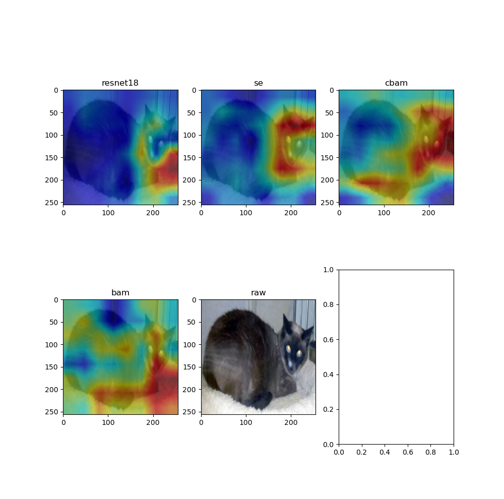
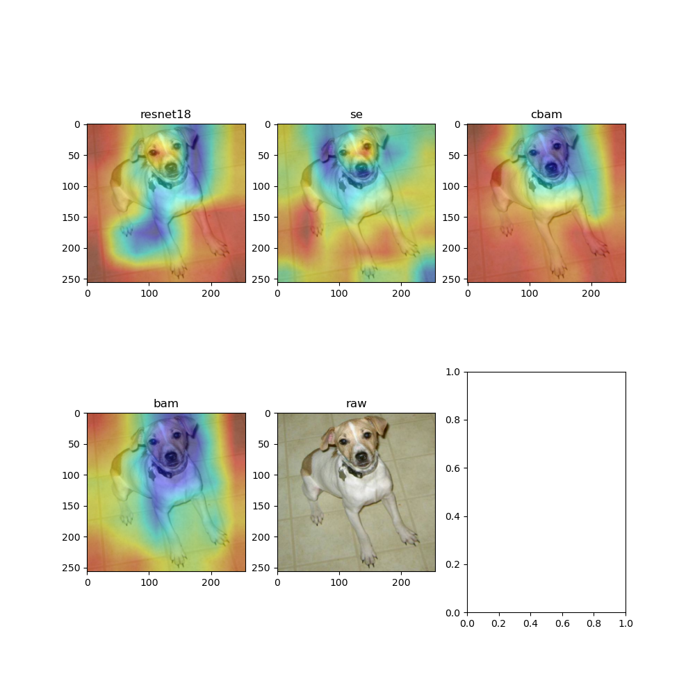

# AttentionModule
这次，我复现了se,cbam和bam这三篇有关于卷积注意力机制的论文并将其insert到resnet18网络之中。之后，我使用猫狗数据训练了resnet18,resnet18_se, resnet18_cbam, resnet18_bam四个模型，并从模型的收敛速度以及power of feature represent来探讨其优缺点。
# Environment
python 3.7    
pytorch 1.5    
torchvision 0.6    
opencv 3.4  
# learning_cure
四个模型的学习曲线分别如下所示，分别为resnet,resnet_se,resnet_cbam, resnet_bam  
  
  
  
  
从这四条曲线可知，四个模型的收敛速度和学习能力相差无几，resnet_bam收敛速度偏慢。在前30个batch中，resnet18的收敛曲线趋于平缓，没有任何明显的抖动。可能是由于注意力机制的存在，使得其它嵌入注意力机制的模型的泛化能力较差，模型方差大。同时，这也有可能是注意力机制中引入的参数而导致，所以在训练注意力机制模型的时候，我们可以考虑采用正则化或dropout来提高模型的泛化能力，降低模型的方差。
# visualization
在这，我使用grad-cam的方法来可视化模型感兴趣的area。  
  
从上图，我们可知注意力机制能够校正模型，使模型关注更具辨别行的区域。而spatial attention会扩大模型的感兴趣区域。以猫狗分类为例，单纯地凭借头部位置来区分其类别的做法有点草率。如果分类类别中包含了四不像，那么模型到底是该将其分为牛还是四不像。spatial attention能够使得模型根据更多的featuure来做出判断。
# Note
在cv2中，其所读取的图像的通道顺序为bgr。而一般的图像显示库所使用的通道顺序为rgb。所以，使用cv2来生成伪彩图的时候，我们要调整其通道顺序。不然，可视化可能会是一下结果。模型的感兴趣区域不在object上，而是在其周围环境。这相当模型并不具备了分类猫狗的能力而是具备了分类环境的能力。当然，这也会给我们一种错觉，让我们误以为模型被训坏了。

