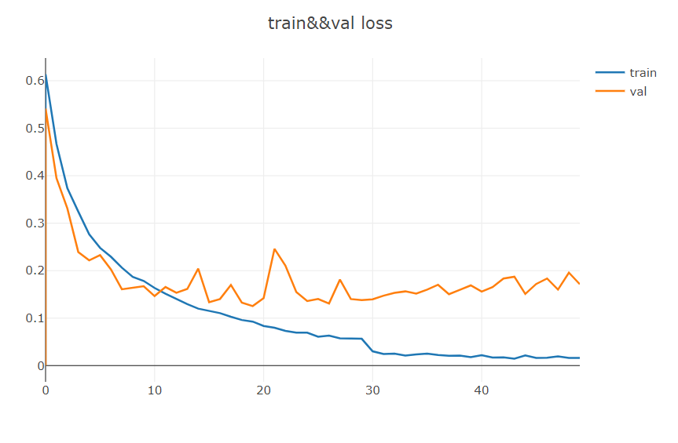
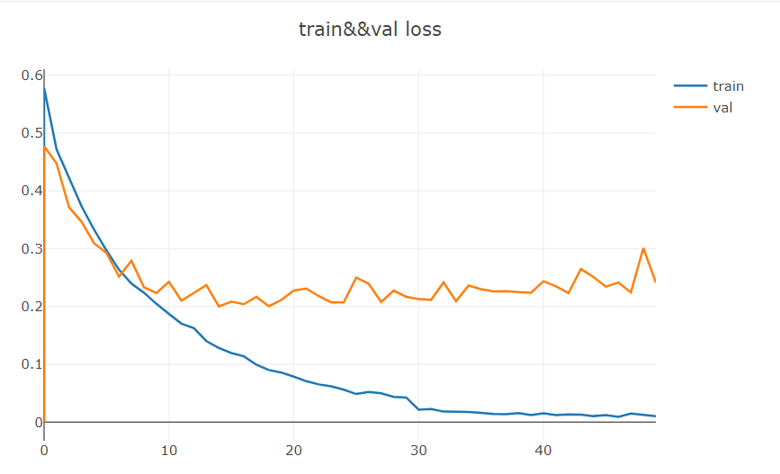
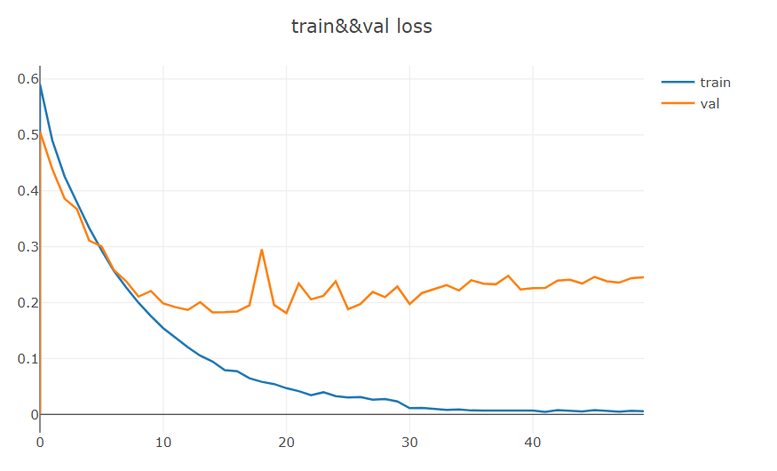
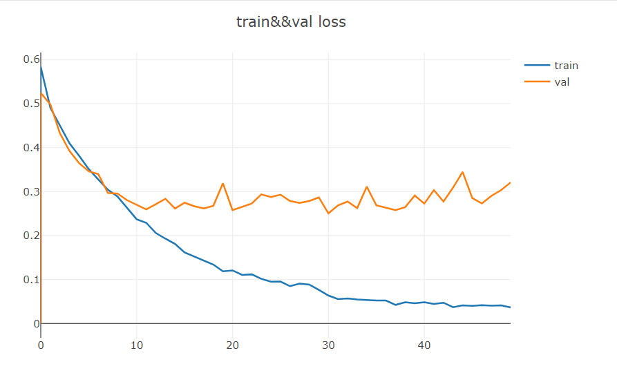

# AttentionModule
这次，我复现了se,cbam和bam这三篇有关于卷积注意力机制的论文并将其insert到resnet18网络之中。之后，我使用猫狗数据训练了resnet18,resnet18_se, resnet18_cbam, resnet18_bam四个模型，并从模型的收敛速度以及power of feature represent来探讨其优缺点。
# Environment
python 3.7    
pytorch 1.5    
torchvision 0.6    
opencv 3.4  
# learning_cure
四个模型的学习曲线分别如下所示，分别为resnet,resnet_se,resnet_cbam, resnet_bam  
  
  
  
  
从这四条曲线可知，四个模型的收敛速度和学习能力相差无几，resnet_bam收敛速度偏慢。在前30个batch中，resnet18的收敛曲线趋于平缓，没有任何明显的抖动。
# visualization

